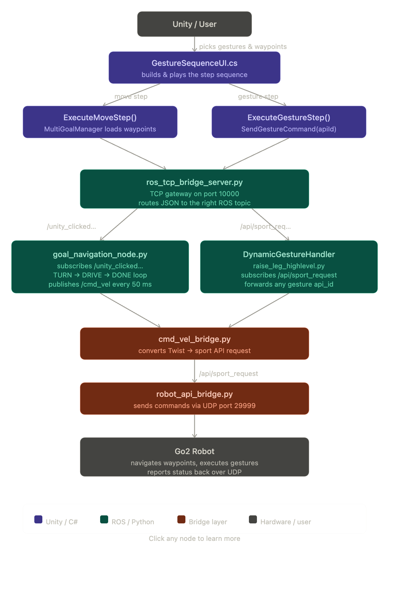

# Gesture Sequence System - Complete API Documentation

## Table of Contents
1. [Unity Components](#unity-components)
2. [ROS Components](#ros-components)
3. [Data Flow](#data-flow)
4. [API Reference](#api-reference)

---

## UNITY COMPONENTS

### GestureSequenceUI.cs
**Location**: `unity/go2_unity_control/Assets/UIScripts/GestureSequenceUI.cs`

**Purpose**: Main controller for gesture sequence creation, editing, and execution.

#### Public Methods

```csharp
/// <summary>
/// Displays the home screen with saved sequences.
/// Hides the configuration screen and gesture panel.
/// </summary>
public void ShowHome()

/// <summary>
/// Displays the configuration screen for creating/editing sequences.
/// Hides the home screen.
/// </summary>
public void ShowConfig()

/// <summary>
/// Adds a new gesture step to the current sequence based on dropdown selection.
/// Updates button visibility for Move steps (shows/hides Add Waypoints button).
/// </summary>
/// <remarks>
/// - For Move steps: button becomes visible, user can add waypoints
/// - For other gestures: button remains hidden
/// </remarks>
public void AddStep()

/// <summary>
/// Saves waypoints from MultiGoalManager to the last Move step.
/// Only works if last step is "Move" type.
/// </summary>
/// <exception cref="Exception">Logs warning if no Move step or MultiGoalManager not found</exception>
public void AddWaypoints()

/// <summary>
/// Saves the current sequence to persistent storage (JSON file).
/// Converts GestureStepData to SavedStep format with waypoints.
/// </summary>
public void SaveSequence()

/// <summary>
/// Displays all saved sequences from GestureDataManager as clickable cards.
/// </summary>
public void DisplaySavedSequences()

/// <summary>
/// Loads a saved sequence into the editor by index.
/// Sets waypoints for Move steps and updates button visibility.
/// </summary>
/// <param name="index">Index of sequence in GestureDataManager.savedSequences</param>
public void EditSavedSequence(int index)

/// <summary>
/// Executes the complete gesture sequence with all steps.
/// Handles both Move (navigation) and Gesture (API command) steps.
/// </summary>
/// <remarks>
/// Execution flow:
/// 1. For Move steps: Navigate through waypoints using MultiGoalManager
/// 2. For Gesture steps: Send API command via ROS and wait for completion
/// 3. Small delay (0.5s) between steps
/// </remarks>
public void PlaySequence()

/// <summary>
/// Clears all steps from current sequence and resets UI.
/// Hides the Add Waypoints button.
/// </summary>
public void ClearSequence()

/// <summary>
/// Initializes a new blank sequence for editing.
/// </summary>
public void StartNewSequence()

/// <summary>
/// Deletes a saved sequence by index and refreshes display.
/// </summary>
/// <param name="index">Index of sequence to delete</param>
public void DeleteSequence(int index)
```

#### Private Methods

```csharp
/// <summary>
/// Adds a gesture step to the UI and internal sequence list.
/// </summary>
/// <param name="stepName">Name of gesture ("Move", "Raise Hand", etc.)</param>
/// <param name="waypoints">List of waypoints (empty for non-Move steps)</param>
private void AddStepToUI(string stepName, List<Vector3> waypoints)

/// <summary>
/// Updates the preview text showing sequence flow.
/// Format: "1. Move(3wp) → 2. Raise Hand → 3. Move(2wp)"
/// </summary>
private void UpdatePreview()

/// <summary>
/// Coroutine that executes the complete sequence.
/// Called by PlaySequence().
/// </summary>
private System.Collections.IEnumerator ExecuteSequenceCoroutine()

/// <summary>
/// Executes a single Move step with waypoint navigation.
/// </summary>
/// <param name="moveStep">GestureStepData containing waypoints</param>
/// <returns>Coroutine that completes when navigation is done</returns>
private System.Collections.IEnumerator ExecuteMoveStep(GestureStepData moveStep)

/// <summary>
/// Executes a single gesture step by sending command to ROS.
/// </summary>
/// <param name="gestureName">Gesture name ("Raise Hand", "Jump", etc.)</param>
/// <returns>Coroutine that completes when gesture duration expires</returns>
private System.Collections.IEnumerator ExecuteGestureStep(string gestureName)

/// <summary>
/// Sends a gesture command to the robot via ROS-TCP bridge.
/// Uses /api/sport/request topic format.
/// </summary>
/// <param name="apiId">Unitree Sport API ID (1016=Hello, 1022=Dance1, etc.)</param>
private void SendGestureCommand(int apiId)

/// <summary>
/// Fallback method for direct TCP socket communication.
/// Used if ROS_TCPBridge component not found.
/// </summary>
/// <param name="apiId">Unitree Sport API ID</param>
private void SendGestureViaTCP(int apiId)

/// <summary>
/// Maps gesture names to Unitree Sport API IDs.
/// </summary>
/// <param name="gestureName">Human-readable gesture name</param>
/// <returns>API ID (1001-1023) or -1 if unknown</returns>
private int GetGestureApiId(string gestureName)

/// <summary>
/// Gets estimated execution duration for a gesture.
/// </summary>
/// <param name="gestureName">Gesture name</param>
/// <returns>Duration in seconds</returns>
private float GetGestureDuration(string gestureName)
```

#### Data Members

```csharp
// UI References
public GameObject homeScreen;              // Home/saved sequences screen
public GameObject configScreen;            // Configuration/editor screen
public TMP_Dropdown gestureStepDropdown;   // Dropdown to select gesture type
public Transform sequenceListParent;       // Container for step items
public GameObject stepItemTemplate;        // Prefab for step list items
public TMP_Text previewText;              // Preview text showing sequence
public Transform savedSequencesPanel;      // Container for saved sequence cards
public GameObject savedSequenceCardTemplate; // Prefab for sequence cards

// Internal State
private readonly List<GestureStepData> sequenceSteps; // Current sequence steps
private readonly List<string> savedSequences;         // Loaded saved sequences
private int editingIndex;                 // Index if editing existing sequence (-1 if new)
```

---

### MultiGoalManager.cs
**Location**: `unity/go2_unity_control/Assets/Multigoalmanager.cs`

**Purpose**: Manages waypoint navigation. Handles goal setting, waypoint visualization, and navigation state.

#### Public Methods

```csharp
/// <summary>
/// Loads waypoints from a gesture step into the manager.
/// Converts Unity coordinates to ROS coordinates and creates markers.
/// </summary>
/// <param name="unityWaypoints">List of Vector3 waypoints in Unity coordinates</param>
/// <remarks>
/// Conversion formula:
/// - rosX = z / scaleZ
/// - rosY = -x / scaleX
/// </remarks>
public void LoadWaypoints(List<Vector3> unityWaypoints)

/// <summary>
/// Starts navigation through loaded waypoints.
/// Begins the walk sequence and updates UI.
/// </summary>
public void StartNavigation()

/// <summary>
/// Checks if navigation is complete (all waypoints reached).
/// </summary>
/// <returns>true if not currently walking, false if still navigating</returns>
public bool IsNavigationComplete()

/// <summary>
/// Adds a single waypoint (Unity coordinates).
/// </summary>
/// <param name="unityPos">Waypoint position in Unity coordinates</param>
public void AddWaypoint(Vector3 unityPos)

/// <summary>
/// Gets list of currently added waypoints in Unity coordinates.
/// </summary>
/// <returns>Copy of current waypoint list</returns>
public List<Vector3> GetCurrentWaypoints()

/// <summary>
/// Clears all waypoints, markers, and resets state.
/// </summary>
public void ClearWaypoints()
```

#### Private Methods

```csharp
/// <summary>
/// Tries to add a waypoint by raycasting from mouse click.
/// Ignores clicks on UI elements.
/// </summary>
private void TryAddWaypoint()

/// <summary>
/// Sends next goal to robot via TCP with length prefix.
/// Advances to next waypoint in sequence.
/// </summary>
private void AdvanceToNextGoal()

/// <summary>
/// Sends TCP packet with 4-byte length prefix (big-endian).
/// </summary>
/// <param name="packet">Data to send</param>
private void SendPacket(byte[] packet)

/// <summary>
/// Sets marker color based on state (pending/active/done).
/// </summary>
/// <param name="m">Marker game object</param>
/// <param name="c">Color to apply</param>
private static void SetMarkerColor(GameObject m, Color c)

/// <summary>
/// Updates status text on UI.
/// </summary>
/// <param name="msg">Status message</param>
private void SetStatus(string msg)
```

#### Data Members

```csharp
// Waypoints (ROS coordinates)
private List<Vector3> _rosGoals;          // Goals in ROS frame
private List<Vector3> _unityPos;          // Corresponding Unity coordinates
private List<GameObject> _markers;        // Visual markers on ground

// Navigation State
private int _currentIndex;                // Current waypoint being navigated to
private bool _isWalking;                  // Currently navigating?

// Network
private TcpClient _tcp;                   // TCP connection to ROS bridge
private NetworkStream _stream;            // TCP stream
private Queue<byte[]> _sendQueue;         // Buffered packets to send

// Coordinate Conversion
public float scaleX = 2.0f;               // Unity units per real meter (X)
public float scaleZ = 2.0f;               // Unity units per real meter (Z)
```

---

## ROS COMPONENTS

### ros_tcp_bridge_server.py
**Location**: `ros_tcp_bridge_server.py`

**Purpose**: TCP gateway between Unity and ROS. Routes waypoints and gesture commands to appropriate topics.

#### Class: TCPBridgeServer(Node)

```python
def __init__(self):
    """
    Initialize TCP bridge server.
    
    Publishers:
    - /unity_clicked_point (geometry_msgs/Point): Waypoint goals
    - /api/sport_request (unitree_api/Request): Gesture commands
    
    Subscribers: None
    
    Port: 10000 (TCP)
    Format: 4-byte length prefix (big-endian) + JSON payload
    """

def start_server(self):
    """
    Start TCP server listening on 0.0.0.0:10000.
    Spawns thread for accepting connections.
    """

def _accept_loop(self):
    """
    Accept incoming TCP connections from Unity.
    Spawns new thread for each client.
    """

def _client_loop(self, conn, addr):
    """
    Handle single client connection.
    Receive messages, parse JSON, route to handlers.
    
    Args:
        conn: Socket connection
        addr: Client address tuple
    """

def _recv_exact(self, conn, n):
    """
    Receive exactly n bytes from socket.
    
    Args:
        conn: Socket connection
        n: Number of bytes to receive
        
    Returns:
        bytes: Received data or None if disconnected
    """

def _parse_json(self, payload: bytes):
    """
    Parse incoming JSON payload.
    Route to gesture or waypoint handler based on content.
    
    Waypoint format: {"x": float, "y": float, "z": float}
    Gesture format: {"header": {"identity": {"api_id": int}}, "parameter": {}}
    """

def _handle_gesture_request(self, data: dict):
    """
    Handle gesture command.
    Queue for publishing to /api/sport_request.
    
    Args:
        data: Dict with 'header' and 'parameter' keys
    """

def _drain_queue(self):
    """
    Drain message queues and publish to ROS topics.
    Called by timer every 0.02s.
    Publishes waypoints and gestures separately.
    """

def _enqueue_point(self, x, y, z):
    """Queue waypoint for publishing."""

def _enqueue_gesture(self, api_id: int, parameter: str):
    """Queue gesture for publishing."""
```

#### Key Features
- Separates waypoints from gestures
- Thread-safe queue for both message types
- Graceful error handling
- Logging for debugging

---

### dynamic_gesture_handler.py (formerly raise_leg_highlevel.py)
**Location**: `src/go2_behavior/go2_behavior/raise_leg_highlevel.py`

**Purpose**: Subscribes to gesture commands and forwards dynamically to robot. No hardcoded sequences.

#### Class: DynamicGestureHandler(Node)

```python
def __init__(self):
    """
    Initialize dynamic gesture handler.
    
    Subscribers:
    - /api/sport_request (unitree_api/Request): From TCP bridge (Unity)
    
    Publishers:
    - /api/sport_request (unitree_api/Request): To robot API bridge
    
    Accepts ANY gesture API ID (1001-1023) dynamically.
    """

def _on_gesture_request(self, msg: Request):
    """
    Receive gesture command and forward to robot.
    
    Args:
        msg: Request message with api_id and parameter
    """

def _log_gesture_name(self, api_id: int, parameter: str):
    """
    Lookup and log gesture name for debugging.
    
    Args:
        api_id: Unitree Sport API ID (1016, 1022, etc.)
        parameter: JSON string with gesture parameters
    """
```

#### Supported Gestures

| API ID | Name | Description |
|--------|------|---|
| 1001 | Damp | Disable motors |
| 1002 | StandUp | Make robot stand |
| 1003 | StandDown | Make robot sit |
| 1004 | RecoveryStand | Safe standing position |
| 1006 | Move (simple) | Old move command |
| 1008 | Move (continuous) | Continuous movement |
| 1016 | Hello | Wave front-right leg (Raise Hand) |
| 1017 | Stretch | Full body stretch |
| 1019 | Wallow | Rolling motion |
| 1022 | Dance1 | Dance sequence 1 |
| 1023 | Dance2 | Dance sequence 2 |

---

### robot_api_bridge.py
**Location**: `robot_api_bridge.py`

**Purpose**: Converts ROS API requests to UDP commands for Go2 robot.

#### Class: RobotApiBridge(Node)

```python
def __init__(self):
    """
    Initialize robot API bridge.
    
    Subscribers:
    - /api/sport_request (unitree_api/Request): From gesture handler
    
    Target: UDP 192.168.123.161:29999 (Unitree sport service)
    """

def _on_request(self, msg: Request):
    """
    Convert ROS Request message to UDP command.
    Send to robot sport service.
    
    Args:
        msg: Request with api_id and parameter
        
    Format sent to robot:
    {
        "api_id": int,
        "parameter": "{...}"
    }
    """
```

---

### goal_navigation_node.py
**Location**: `src/go2_behavior/go2_behavior/goal_navigation_node.py`

**Purpose**: Closed-loop navigation controller. Sends Twist commands to move robot to goals.

#### Class: GoalNavigationNode(Node)

```python
def __init__(self):
    """
    Initialize goal navigation node.
    
    Subscribers:
    - /unity_clicked_point (Point): Waypoint goals
    - /utlidar/robot_pose (PoseStamped): Robot position
    
    Publishers:
    - /cmd_vel (Twist): Movement commands
    - /goal_reached (Bool): Goal reached signal
    - /nav_status (String): Status updates
    - /estimated_pose (PoseStamped): Estimated position
    
    Notifies Unity via UDP when goal reached.
    """

def _on_pose(self, msg: PoseStamped):
    """
    Receive robot pose from LIDAR.
    Update internal state: robot_x, robot_y, robot_yaw
    """

def _on_goal(self, msg: Point):
    """
    Receive new goal waypoint.
    Set phase to TURNING and begin navigation.
    """

def _loop(self):
    """
    Main control loop (50ms cycle).
    
    State machine:
    1. IDLE: Waiting for goal
    2. TURNING: Rotate to face goal (heading error < 0.08 rad)
    3. DRIVING: Move forward while steering to maintain heading
    4. GOAL_REACHED: Distance < goal_tolerance (0.35m)
    """

def _send(self, vx, wz):
    """
    Publish Twist command.
    
    Args:
        vx: Forward velocity (m/s)
        wz: Angular velocity (rad/s)
    """
```

#### Parameters

```
max_speed: 0.35 m/s (max forward speed)
turn_speed: 0.6 rad/s (max rotation speed)
goal_tolerance: 0.35 m (stop distance)
heading_tolerance: 0.08 rad (5°, alignment threshold)
pose_timeout: 3.0 s (stale pose timeout)
unity_ip: 127.0.0.1
unity_reached_port: 10004 (UDP)
```

---



---

## API REFERENCE

### ROS Topics

#### Published by TCP Bridge

**Topic**: `/unity_clicked_point`
**Type**: `geometry_msgs/Point`
**Format**:
```
x: float (ROS X coordinate)
y: float (ROS Y coordinate)
z: float (always 0)
```

**Topic**: `/api/sport_request`
**Type**: `unitree_api/Request`
**Format**:
```
header.identity.api_id: int (1001-1023)
parameter: string (JSON, typically "{}")
```

#### Subscribed by Navigation

**Topic**: `/unity_clicked_point` → Consumed by `goal_navigation_node`
**Topic**: `/utlidar/robot_pose` → Provides robot position

#### Subscribed by Gestures

**Topic**: `/api/sport_request` → Consumed by `DynamicGestureHandler`

---

### Coordinate Systems

#### Unity Coordinates
- Origin: Center of ground plane
- X-axis: Left/Right
- Z-axis: Forward/Backward
- Scale: 2 Unity units = 1 real meter

#### ROS Coordinates
- X-axis: Forward/Backward
- Y-axis: Left/Right
- Conversion:
  ```
  ros_x = unity_z / scaleZ
  ros_y = -unity_x / scaleX
  ```

---

## Error Handling

### Common Issues & Solutions

| Issue | Cause | Solution |
|-------|-------|----------|
| Button doesn't appear | Component not assigned | Check Inspector: assign waypoints button |
| No movement | TCP bridge not running | `ros2 run ros_tcp_bridge bridge` |
| Gesture not executing | Robot API bridge offline | Check UDP port 29999 on robot |
| Waypoints not saving | MultiGoalManager not found | Ensure in same scene |
| Sequence won't load | JSON format error | Check file permissions |

---

## Debugging Checklist

- [ ] ROS bridge running on port 10000
- [ ] Robot connected at 192.168.123.161:29999
- [ ] Unity can reach TCP bridge (localhost:10000)
- [ ] All subscribers active: `ros2 topic list`
- [ ] Messages flowing: `ros2 topic echo /api/sport_request`
- [ ] Console shows no errors
